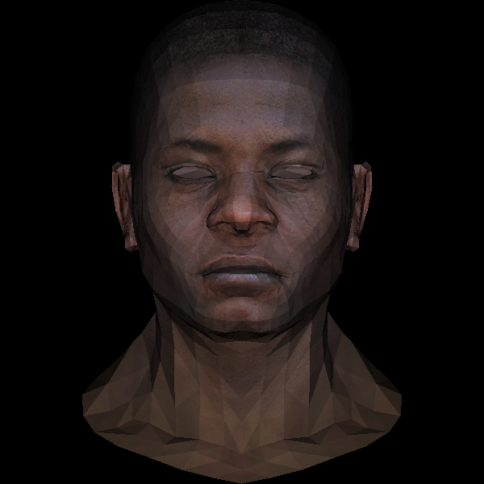
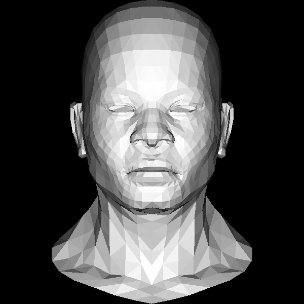
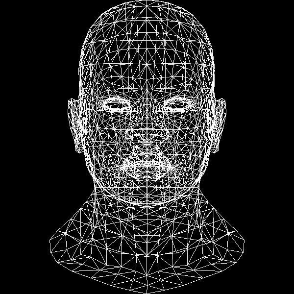

## 3d-renderer
This is a simple 3d renderer written in python that outputs to a bitmap file. The entirety of the renderer is written with no graphics libraries and using numpy only to clear an array. Can render wireframe, shaded and textured images from .obj and .tga files. Based loosely on https://github.com/ssloy/tinyrenderer ❤️. 
## TODO:
- Smooth shading.
- Rotation.
- Ray tracing.

## Examples
Render of [this obj](https://github.com/ssloy/tinyrenderer/blob/f6fecb7ad493264ecd15e230411bfb1cca539a12/obj/african_head.obj). 
### UV textured.

### Flat shaded.
 
### Wireframe.
 
 
